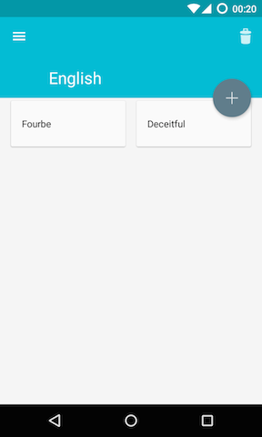
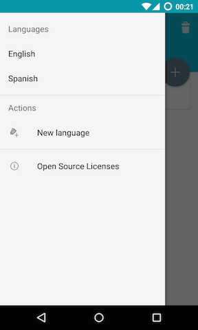

# Learn It

# What is it?

Learn It won't try to learn a specific language!

Learn It won't try to buy you a magic method to learn a language quickly!

No, Learn It makes one thing but try to make it well!

It is an assistant which helps you to learn your lists of vocabulary.
There aren't miracles in life. If you want something, you must work hard to got it.
Learn It has been developed with this philosophy.

 

# Why?

At the beginning of a week-end, I launched me a challenge: "You'll develop an application in a week-end!".
Currently, I'm working hard my english so I decide to develop this app for the challenge,
but also develop a good demo for the usage of the latest support library, android support design.

This last project is a android support library like the old android support v4 or, more recent,
the android support v7 (and these sub projects like recycleview-v7 and cartview-v7) but oriented
on the Material Design. It helps developers to make beautiful apps with older versions of Android
(API 7+).

Soon, a french tutorial should be written on the platform *Zeste de Savoir*. This tutorial will be
linked here!

# Pre-requisites

To install this app on your device, you can install it from the Play Store (Soon) or in an Android
environment. To do this last thing, you must to have:

- Android SDK 22
- Android Build Tools 22.0.1
- Android Support Repository 22.2

# Contribute

If you would like contribute, PR is welcome but I'm a very bad designer. So, if you would like to
create an icon launcher, you can PR for that!

# Libraries

Thanks to these libraries really helpful!

- Android Support v4
- Android Support v7
- Android Support Design
- RecycleView-v7
- CartView-v7
- Dagger - http://square.github.io/dagger
- ButterKnife - http://jakewharton.github.io/butterknife
- Timber - http://github.com/JakeWharton/timber
- SQLBrite - https://github.com/square/sqlbrite
- RxJava - https://github.com/ReactiveX/RxJava
- RxAndroid - https://github.com/ReactiveX/RxAndroid
- auto-parcel - https://github.com/frankiesardo/auto-parcel
- AndroidSwipeLayout - https://github.com/daimajia/AndroidSwipeLayout
- LicenseDialog - https://psdev.de/LicensesDialog/

# License

    Copyright 2015 Gérard Paligot

    Licensed under the Apache License, Version 2.0 (the "License");
    you may not use this file except in compliance with the License.
    You may obtain a copy of the License at

       http://www.apache.org/licenses/LICENSE-2.0

    Unless required by applicable law or agreed to in writing, software
    distributed under the License is distributed on an "AS IS" BASIS,
    WITHOUT WARRANTIES OR CONDITIONS OF ANY KIND, either express or implied.
    See the License for the specific language governing permissions and
    limitations under the License.